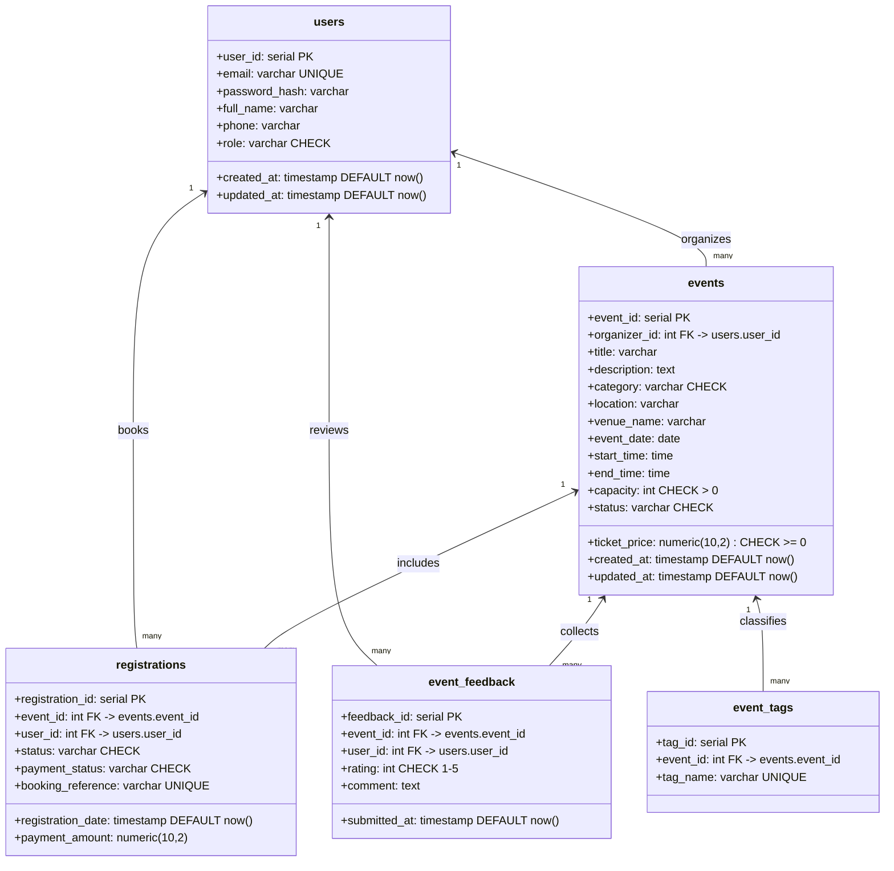
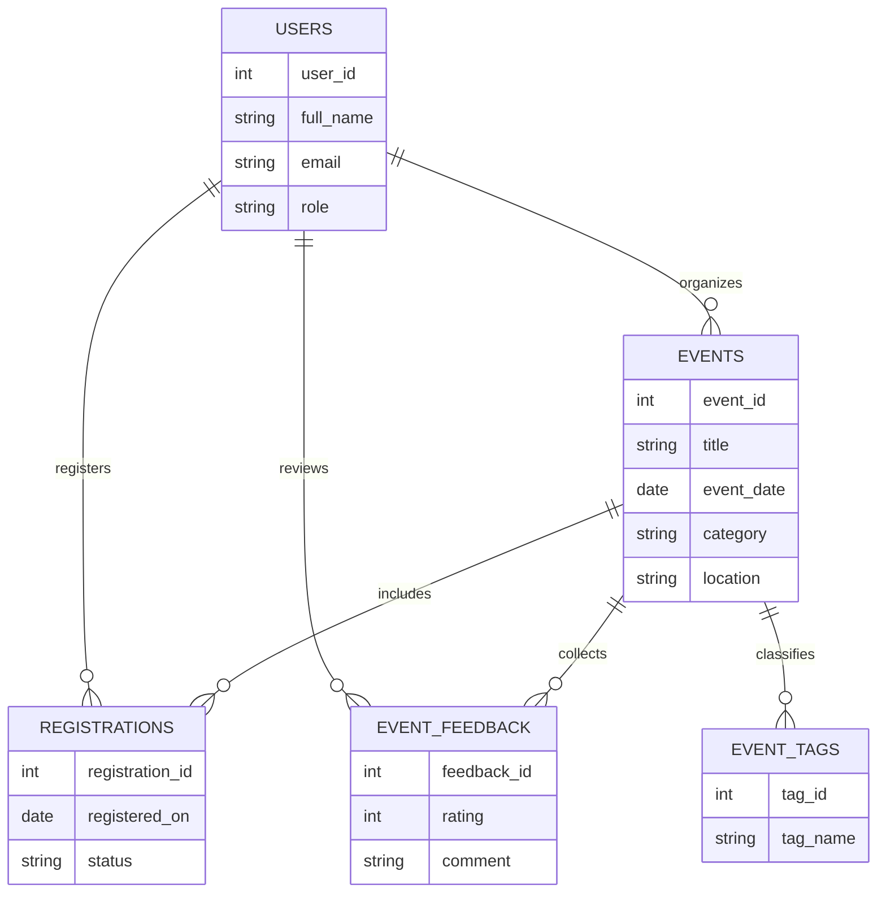

# EventHive: AI-Assisted Event-Managing Database System

## Objectives

- To design a normalized event management database that balances analytical and transactional workloads.
- To enable natural language interaction with PostgreSQL through an AI-assisted application layer.
- To safeguard data integrity by enforcing relational constraints, validation rules, and indexed access paths.
- To demonstrate deployable tooling for laboratory evaluation, including schema bootstrapping and health monitoring.

## Introduction

EventHive is a laboratory-scale platform that merges an event management data model with AI-driven query generation to simplify analytical exploration. The prototype showcases how PostgreSQL’s relational guarantees can coexist with the flexibility of on-demand SQL authoring through Google Gemini Flash. Users receive immediate visibility into generated statements, execution notices, and tabular results within a focused single-page interface. By combining a modern web stack with a teaching schema, the project highlights best practices in database systems coursework while remaining accessible for future iteration.

## Body

**System Overview:** The solution is organized as a Bun-powered Express backend backed by PostgreSQL and exposed through a static Tailwind interface. The server hydrates prompts with schema metadata, brokers secure execution through the `pg` and Neon clients, and streams structured responses to the browser. Frontend modules render SQL, system notices, and paginated results without reloads, providing students with an instrumentation-rich view of every round trip.

**Database Architecture:** The schema prioritizes clarity and referential integrity across five core relations—`users`, `events`, `registrations`, `event_feedback`, and `event_tags`. Each table uses surrogate primary keys, cascading foreign keys, and check constraints that encode domain rules such as attendance capacity, rating ranges, and enumerated status codes. Composite indexes (for example, `events(organizer_id, event_date)` and `registrations(event_id, status)`) mirror the query fragments that the AI frequently generates, ensuring predictable performance for trend analysis and transactional lookups. Aligned with the DBA StackExchange guidance on separating logical ER views from physical schemas, Figure 1 enumerates the implemented columns, data types, and constraints, while Figure 2 abstracts the underlying entities and business relationships.

_Figure 1: Physical schema diagram for the EventHive PostgreSQL database._

**AI-Orchestrated Query Pipeline:** The query route composes structured prompts with table summaries from `schema-context.js`, requests JSON-formatted plans from Gemini Flash, and executes each returned statement sequentially. A validation layer rejects destructive keywords, sequences execution to respect foreign key dependencies, and merges PostgreSQL `NOTICE` messages with AI guidance so learners can inspect both logical reasoning and runtime diagnostics. This orchestration enables dynamic PL/pgSQL generation, supporting ad hoc analytics such as capacity utilization, revenue projections, and attendee segmentation without prebuilt stored routines.

**Performance, Integrity, and Security Controls:** The system enforces least-privilege database connectivity through environment-scoped credentials, while the backend wraps execution in timing instrumentation to surface long-running patterns. Index coverage, uniqueness constraints, and cascading options prevent duplication and orphaned data during insertions and deletions. Tailored status enumerations and price validations reduce malformed records, and booking references give auditors deterministic identifiers for reconciliation. Together, these measures exemplify laboratory expectations for resilient relational workloads, and the cardinalities summarized in Figure 2 justify the chosen constraint strategy.

_Figure 2: Conceptual entity-relationship view showing participant, event, and tagging flows._

**Deployment and User Experience:** The development workflow aligns with lab delivery by bundling schema initialization scripts, health endpoints, and Tailwind build tasks within Bun. Students launch the stack with `bun run dev`, while schema snapshots (`public/schema.html`) aid revision. The dark UI applies copy-to-clipboard assistance, accordion-based result browsing, and status chips, making the dataset approachable for guided exercises and self-directed exploration.

## Discussion

EventHive demonstrates how AI augmentation can complement, rather than replace, disciplined database design in academic settings. Continuous validation and monitoring maintain trust when autogenerated SQL is executed, giving learners guardrails while still exposing them to complex joins, CTEs, and window functions. The project also surfaces open considerations such as budgeting for Gemini API quotas, managing prompt drift across schema revisions, and hardening authentication for multi-user deployments. Scaling strategies would focus on partitioning large registration volumes and introducing caching for repeated analytical prompts. Future lab iterations could add automated test harnesses that replay exemplar questions and verify execution plans, ensuring regressions are caught before demonstrations. Finally, embedding role-based access control at the application tier would align the prototype with institutional policies for student data handling.

## Conclusion

The EventHive project fulfills its laboratory objectives by coupling a well-indexed relational schema with an intelligent query assistant. Its architecture highlights best practices in data integrity, workload observability, and human-centered feedback. With incremental enhancements around security and automation, the platform is positioned to remain a relevant teaching aid for advanced database systems courses.

## References

- Google Cloud: Gemini API Documentation - https://cloud.google.com/vertex-ai/docs/generative-ai/model-reference/gemini
- Neon PostgreSQL Serverless Docs - https://neon.tech/docs/introduction
- PostgreSQL 16 Documentation: Data Definition - https://www.postgresql.org/docs/current/ddl.html
- Walter Mitty. “ER vs database schema diagrams.” Database Administrators Stack Exchange. https://dba.stackexchange.com/questions/119380/er-vs-database-schema-diagrams
